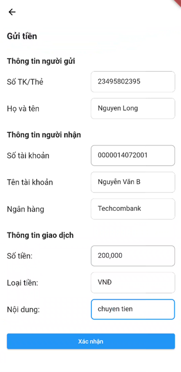
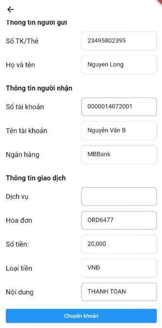

GATEWAY KẾT NỐI GIỮA NGÂN HÀNG VỚI TỔ CHỨC PHÁT HÀNH QR (NAPAS)

Mô tả

Gateway kết nối giữa ngân hàng và Tổ chức phát hành QR (NAPAS) là một hệ thống quan trọng trong quá trình thanh toán di động. Nó cung cấp các chức năng cho việc truyền thông và xử lý dữ liệu giữa ngân hàng và tổ chức phát hành QR.

Chức năng:
1. Tạo mã QR 24/7, mã QR PUSH
   a. Tạo mã QR quảng cáo
   
   
   
   b. Tạo mã QR 24/7 và QR PUSH
   
   
   
2. Quản lý mã QR
   
   
   
3. Quản lý giao dịch
   
   a. Thông tin các giao dịch
   
   
   
   b. Chi tiết các luồng đi giao dịch
   
   
   
   c. Thông tin chuỗi JSON được truyền
   
   
   
4. Quét mã QR (Ứng dung điện thoại)
   
   a. Quét mã QRIBFT

   

   b. Quét mã QRPUSH

   
